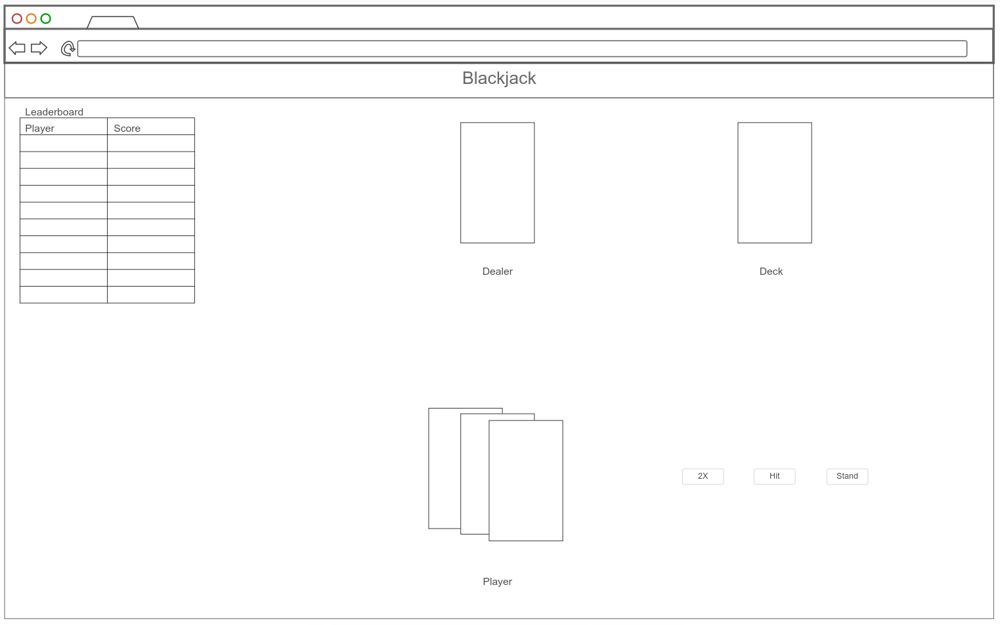

# Brigham's Blackjack

[Play Here](https://brighamblackjack.click)

## 🚀 Specification Deliverable

For this deliverable I did the following. I checked the box `[x]` and added a description for things I completed.

- [x] Proper use of Markdown
- [x] A concise and compelling elevator pitch
- [x] Description of key features
- [x] Description of how you will use each technology
- [x] One or more rough sketches of your application. Images must be embedded in this file using Markdown image references.

### Elevator pitch

We may be at BYU, but let's face it - gambling is really fun. However, many of us do not want to put our bank accounts or eternal salvation in jeapordy through the sinful, financially risky practice of gambling. This fake-money blackjack website allows users to experience the fun of gambling without having to go bankrupt or go to hell. Users can play blackjack against the computer dealer using standard rules, look at their win rate throughout previous games, and compare their success to other players. Each user who falls below the minimum threshold of credits in their account will have a base amount replenished at the end of each day - enough to let them keep playing tomorrow, but little enough to keep them worried about losing it for the authentic gambling experience.

### Design

Here is a basic mockup of how the website would look during the game. It would also have separate pages for the "about the website" information and for login.

### Key features

- Secure login over https
- Display of cards
- Options to deal cards, double down, hit, and stand
- Credits replenish daily at midnight
- Leaderboard of top scores from players, updated in realtime
- "About" page with website information and blackjack rules

### Technologies

I am going to use the required technologies in the following ways.

- **HTML** - HTML used appropriately throughout. Three pages: about, login, game.
- **CSS** - CSS styling that is clear and clean to minimize user confusion. Colors and space will be neatly used and the cards will be easy to read.
- **React** - Login/logout and all interactive gameplay components. Backend endpoint calls will also be performed here.
- **Service** - Endpoints will be implemented to support:
  - Log in/out
  - Storing of data after each round of the game
  - Storing/retrieving a user's credits
  - Displaying jokes from [Geek Jokes API](https://github.com/sameerkumar18/geek-joke-api) on the "about" page
- **DB/Login** - Authentification information, previous games, and credit amounts will be stored in the database.
- **WebSocket** - The current scores/credit amounts for each player will be displayed on a leaderboard and updated in realtime.

## 🚀 AWS deliverable

For this deliverable I did the following. I checked the box `[x]` and added a description for things I completed.

- [x] **Server deployed and accessible with custom domain name** - [My server link](https://startup.brighamblackjack.click).

## 🚀 HTML deliverable

For this deliverable I did the following. I checked the box `[x]` and added a description for things I completed.

- [x] **HTML pages** - Index page for login, Play page for the main game, and About page for rules and Joke API.
- [x] **Proper HTML element usage** - I used appropraite HTML tags throughout, including main, menu, nav, header, footer, div, etc.
- [x] **Links** - There are links between pages and a link to my github page.
- [x] **Text** - The rules for the game are displayed on the about page, as well as a few other small text blocks.
- [x] **3rd party API placeholder** - The About page has a placeholder where I will implement the Geek Jokes API.
- [x] **Images** - I don't specifically need images for the game itself so I included some memes on the about page.
- [x] **Login placeholder** - The index landing page is a placeholder for a login page.
- [x] **DB data placeholder** - DB will be used to store/retrieve per-user credit amounts, as well as data about the games they play.
- [x] **WebSocket placeholder** - The leaderboard will be updated in realtime with websocket.

## 🚀 CSS deliverable

For this deliverable I did the following. I checked the box `[x]` and added a description for things I completed.

- [x] **Header, footer, and main content body** - Header and footer are consistent between pages and have been styled to have a title/logo and a navbar on the header and my name/github link on the footer. Login page has no navigation.
- [x] **Navigation elements** - The header navbar has links to play and about pages, as well as a logout button that will log users out and return them to the login page.
- [x] **Responsive to window resizing** - Used flexbox throughout. Per Dr. Ventura's suggestion, I didn't worry too much about mobile sizing, but the content is dynamically arranged, so it should work between different sizes alright.
- [x] **Application elements** - Placeholders for game functions are styled. Includes buttons, cards, and the leaderboard.
- [x] **Application text content** - Text used throughout, especially on the about page.
- [x] **Application images** - Memes on the about page.

## 🚀 React part 1: Routing deliverable

For this deliverable I did the following. I checked the box `[x]` and added a description for things I completed.

- [x] **Bundled using Vite** - I used vite and npm to install react and build for deployment.
- [x] **Components** - I converted all pages to jsx component format and converted my CSS to CSS modules to avoid style leakage between pages.
- [x] **Router** - I added the functionality of switching between pages with routing.

## 🚀 React part 2: Reactivity deliverable

For this deliverable I did the following. I checked the box `[x]` and added a description for things I completed.

- [x] **All functionality implemented or mocked out** - The full game of blackjack is playable with bets, score leaderboard mockup, dealer logic, and JS/CSS combo animations on play.jsx page. Login placeholder using localStorage on login.jsx page. API call placeholder on about.jsx page under quote.
- [x] **Hooks** - useEffect and useState are used throughout, especially for the game functionality, with scores, hands, leaderboard, and game states using both hooks. play.jsx, about.jsx, unauthenticated.jsx, and app.jsx all have useState in them, for things such as username, password, decks and hands of cards, scores, credits, and changing display texts. There are about 50-60 lines worth of useEffect hooks/functionality in play.jsx right before the return statement, lines 216-278, mostly for updating cards, scores, current game stage, and the leaderboard.

## 🚀 Service deliverable

For this deliverable I did the following. I checked the box `[x]` and added a description for things I completed.

- [x] **Node.js/Express HTTP service** - Added index.js service for login/logout, auth, scores, and leaderboard.
- [x] **Static middleware for frontend** - Included static middleware through app.use(express.static('public')); line.
- [x] **Calls to third party endpoints** - Called an API for jokes in about.jsx.
- [x] **Backend service endpoints** - Endpoints for scores and leaderboard, as well as login/logout.
- [x] **Frontend calls service endpoints** - play.jsx calls score/leaderboard endpoints, authenticated.jsx and unauthenticated.jsx call login endpoints.
- [x] **Supports registration, login, logout, and restricted endpoint** - Website requires login to play game.

## 🚀 DB deliverable

For this deliverable I did the following. I checked the box `[x]` and added a description for things I completed.

- [x] **Stores data in MongoDB** - Users and scores are stored in MongoDB and accessed through database.js
- [x] **Stores credentials in MongoDB** - User info and token are stored in MongoDB

## 🚀 WebSocket deliverable

For this deliverable I did the following. I checked the box `[x]` and added a description for things I completed.

- [x] **Backend listens for WebSocket connection** - peerProxy.js defines a websocket server which listens for messages and forwards between clients.
- [x] **Frontend makes WebSocket connection** - WebSocket connection is opened in app.jsx and passed to play.jsx
- [x] **Data sent over WebSocket connection** - A ping is sent over WebSocket every time a user finishes a game, which prompts other users' leaderboards to update.
- [x] **WebSocket data displayed** - Technically, no data is needed to "display" though the name and timestamp is logged with each received message. The actual content from each change on another client is sent to the database and WebSocket prompts a refresh of info from the DB.
- [x] **Application is fully functional** - Everything is working as intended, no placeholders.
